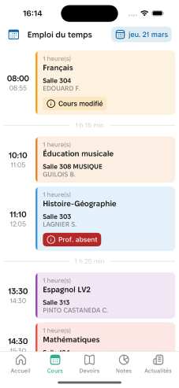

# Les différentes façons de naviguer dans Papillon

Dans Papillon, plusieurs méthodes de navigation sont disponibles pour assurer une utilisation simple et efficace.

## La barre de navigation

La barre de navigation située en bas de l'écran facilite la navigation dans l'application. Elle comprend plusieurs onglets :

- **Accueil**
- **Cours**
- **Devoirs**
- **Notes**
- **Actualités**

Utilisez ces onglets pour accéder rapidement aux différentes sections de Papillon et optimiser votre expérience utilisateur.

## Accueil

L'accueil vous offre une vue récapitulative sur :  

- Votre emploi du temps du jour  
- Votre cours actuel ou à venir  

Ainsi qu'un accès simplifié à :  

- Votre récapitulatif de vie scolaire  
- Vos messages  
- Vos notes/compétences  
- Le reste de votre emploi du temps  

## Cours

L'onglet cours vous permet d'accéder à votre emploi du temps. Vous pouvez consulter vos cours par jour, ainsi que les détails de chaque cours.

    
  

